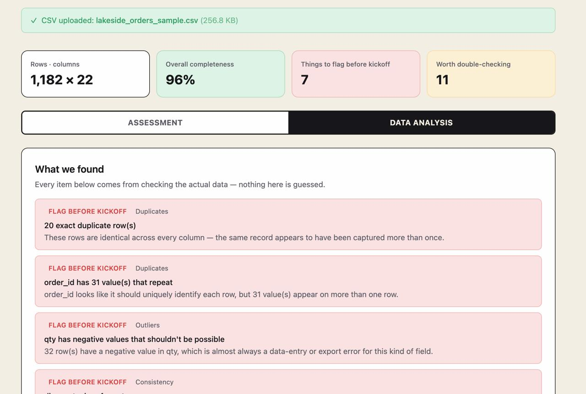

# Ai CSV Onboarding Assistant

A React app that receives a client CSV, develops an analysis based on the contents including (completeness, duplicates, consistency, outliers), and generates a quality assessment to understand the CSV file and prepare a list of questions to ask to the client at kickoff.

Built for the Keyrus AI Developer Intern technical challenge, for the `lakeside_orders_sample.csv` scenario. The analysis logic is column agnostic so it makes no assumptions about this specific file's columns, and was also verified against a second, differently shaped CSV.



## What it does

1. **Upload a CSV in the browser**: The file is read and parsed entirely client-side.
2. **Analyze it in real code** — Data quality checks (completeness, duplicates, consistency, outliers) are computed by JavaScript, not guessed at by the LLM.
3. **One deliberate LLM use case**: The computed findings are sent to the LLM, which writes a narrative assessment with kickoff questions included about the contents found in the csv file.
4. **Present it like an assessment**: The data analysis and the AI-generated assessment are presented together in an easy to follow layout;
## Getting it running

```bash
npm install
npm run dev
```

Open the printed local URL (typically `http://localhost:5173`).

To run the test suite or a production build:

```bash
npm test
npm run build
```

## Credentials

The app calls the Anthropic API **directly from your browser** with your own API key, there is no backend, and no key is ever committed to this repo (see `.gitignore`).

1. Get a key at [console.anthropic.com](https://console.anthropic.com) (API Keys → Create Key). You'll need billing/credits set up on the account.
2. Run the app and paste the key into the **"Anthropic API key"** field at the top of the page.
3. The key is stored only in `sessionStorage` for that browser tab so it's never written to disk, never sent anywhere but `api.anthropic.com`, and disappears when you close the tab.

Without a key, everything except the "Generate assessment" step still works (upload, analysis, findings).

## Project structure

```
├── README.md
├── NOTES.md
├── skill/                     # required Claude Skill deliverable
│   └── SKILL.md
├── data/
│   └── lakeside_orders_sample.csv
└── src/
    ├── App.jsx                 # top-level state + layout
    ├── components/
    │   ├── FileUpload.jsx
    │   ├── ApiKeySettings.jsx
    │   ├── OverviewSummary.jsx
    │   ├── FindingsList.jsx
    │   ├── KickoffQuestions.jsx
    │   └── ColumnDetail.jsx    # collapsed, opt-in per-column table
    └── lib/
        ├── csvParser.js
        ├── analysis/           # completeness, duplicates, consistency, outliers, findings
        │   └── *.test.js       # Vitest unit tests, incl. checks against real sample data
        └── llm/
            ├── client.js       # Anthropic SDK call (structured JSON output)
            └── prompts.js      # the one prompt + the profile→facts summarizer
```

## Tech stack

React 19 + Vite, Tailwind CSS v4, PapaParse, `@anthropic-ai/sdk` (called with `dangerouslyAllowBrowser: true` since there's no backend), Vitest for unit tests.

## Known gaps / what I'd do next

- Cross-field logical inconsistency checks (e.g. a row marked "shipped" with no ship date) aren't implemented as their own category — related issues currently show up individually in Completeness/Consistency findings rather than as a distinct "this doesn't add up" class of finding.
- No dedicated mobile layout; the app is usable but tuned for desktop.
- The narrative assessment isn't cached so regenerating costs another API call for the same file.
- See `NOTES.md` for more on what was cut and why, and a two-more-days plan.
